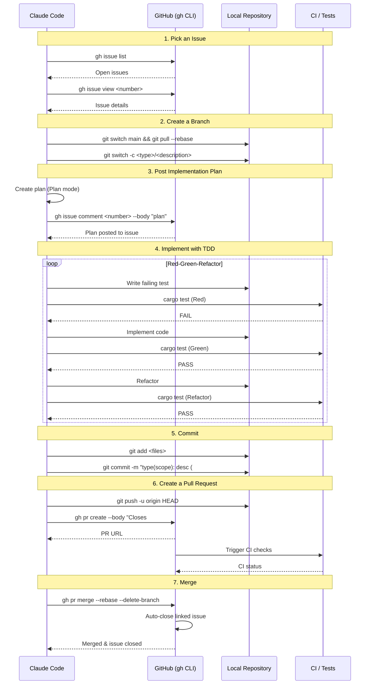

# Issue-Driven Development Workflow

This document defines the development workflow for the todox project. All development follows an issue-driven approach using `gh` CLI for GitHub operations.

## Workflow Overview



## Rules

- **No work without an issue** — every change must be linked to a GitHub issue
- **Use `gh` CLI** for all GitHub operations (issues, PRs, project board)
- **Follow TDD** — write failing tests first, then implement, then refactor
- **Post the plan to the issue** — share the implementation plan as a comment before coding
- **Link PRs to issues** with `Closes #<number>` for auto-closing

## Workflow Steps

### 1. Pick an Issue

Browse open issues and select one to work on.

```bash
# List open issues
gh issue list

# View a specific issue
gh issue view <number>

# Check the project board
gh project item-list --owner <owner> --format json
```

- Read the issue description, acceptance criteria, and any linked discussions
- Check that the issue is not already assigned or in progress
- Assign yourself to the issue before starting work

### 2. Create a Branch

Create a feature branch from `main` with a descriptive name.

```bash
# Ensure you're on the latest main
git switch main
git pull --rebase

# Create a branch (one branch per issue)
git switch -c <type>/<description>
```

Branch naming conventions:
- `feature/<description>` — new functionality
- `fix/<description>` — bug fixes
- `refactor/<description>` — code restructuring
- `docs/<description>` — documentation changes
- `chore/<description>` — maintenance tasks

### 3. Post Implementation Plan

After creating a branch, use Plan mode to design the implementation approach. Then post the plan as a comment on the issue using `gh` CLI. The plan must be written in English.

```bash
# Post the implementation plan to the issue
gh issue comment <number> --body "$(cat <<'EOF'
## Implementation Plan

### Overview
Brief description of the approach.

### Changes
- **file_or_module** — what will be changed and why
- **file_or_module** — what will be changed and why

### Testing Strategy
- What tests will be added or updated
EOF
)"
```

- Use Plan mode to explore the codebase and design the approach before writing code
- Write the plan in English for consistency across the project
- Wait for feedback on the plan if working with a team before proceeding to implementation
- The plan serves as documentation for the rationale behind implementation decisions

### 4. Implement with TDD

Follow the Red-Green-Refactor cycle:

1. **Red** — Write a failing test that defines the expected behavior
2. **Green** — Write the minimum code to make the test pass
3. **Refactor** — Clean up the code while keeping tests green

```bash
# Run tests continuously during development
cargo test

# Run specific tests
cargo test <test_name>

# Check formatting
cargo fmt --check

# Type-check
cargo check
```

### 5. Commit

Use conventional commit format and reference the issue number.

```bash
# Stage changes
git add <files>

# Commit with conventional format and issue reference
git commit -m "type(scope): description (#<issue-number>)"
```

Commit message examples:
- `feat(scanner): add support for custom tag patterns (#12)`
- `fix(diff): handle binary files gracefully (#8)`
- `test(check): add threshold validation tests (#15)`
- `docs(readme): update installation instructions (#3)`

### 6. Create a Pull Request

Push the branch and create a PR that links to the issue.

```bash
# Push the branch
git push -u origin HEAD

# Create a PR linking to the issue
gh pr create \
  --title "type(scope): description" \
  --body "$(cat <<'EOF'
## Summary

Brief description of changes.

Closes #<issue-number>

## Test Plan

- [ ] Unit tests added/updated
- [ ] Integration tests added/updated
- [ ] Manual testing completed
EOF
)"
```

- The `Closes #<number>` keyword in the PR body auto-closes the issue on merge
- Ensure the PR title follows conventional commit format
- Include a test plan in the PR description

### 7. Merge

After review and CI passes, merge the PR.

```bash
# Merge with rebase strategy and delete the branch
gh pr merge --rebase --delete-branch

# Verify the issue was auto-closed
gh issue view <number>
```

- Use `--rebase` to maintain a linear commit history
- Use `--delete-branch` to clean up the feature branch
- Verify the linked issue was automatically closed after merge
